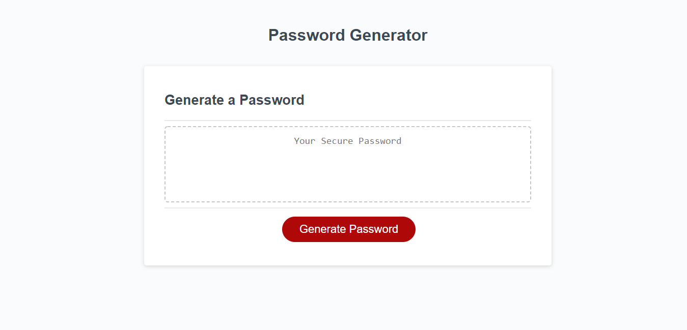
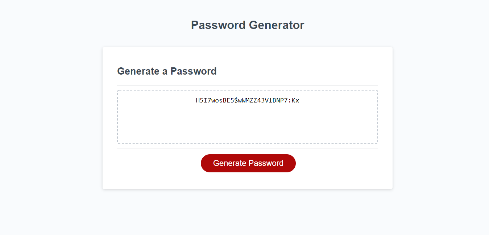
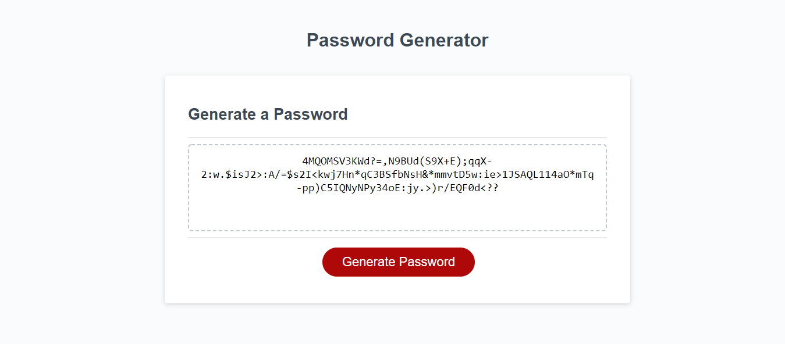

# Password Generator JavaScript

## Table of Contents

- [Description](#description)
- [Usage](#usage)
- [Visuals](#visuals)
- [Authors and Acknowledgements](#authors-and-acknowledgements)

## Description

 Although I started working on the project with an HTML and CSS mindset, the function of the password generator was ultimately created using JavaScript. The user is prompted to type a number between 8 and 128 for the length of their password. If the user inputs an invalid character or a number outside of the range, the user is alerted and the process starts over again. After selecting the length of the password, the user is confirm the types of characters that they want to include in their password. As they confirm their character types, ```var acceptedCharacters``` concatinates with those possible character strings. Then, if at least one character type is confirmed, a random selection of characters creates the password (stored in ```var passDraft```) to the user's desired length. If no character type is selected, the user is alerted and the process starts over again.

## Usage

The password generator can be used to create a randomized password between 8 and 128 characters. Users can choose character types such as lowercase letters, uppercase letters, numbers, and special characters. When all data is collected from the user, a password is generated in the text box, ready to be copied.

## Visuals







## Authors and Acknowledgements

This project uses starter code provided by the UNCC coding bootcamp, specifically from [Xandromus](https://github.com/coding-boot-camp/friendly-parakeet).

My instructor, Anthony Cooper, provided a JavaScript template to help jumpstart my coding process. This template included the beginning of the ```generatePassword``` function and the first five variables. 